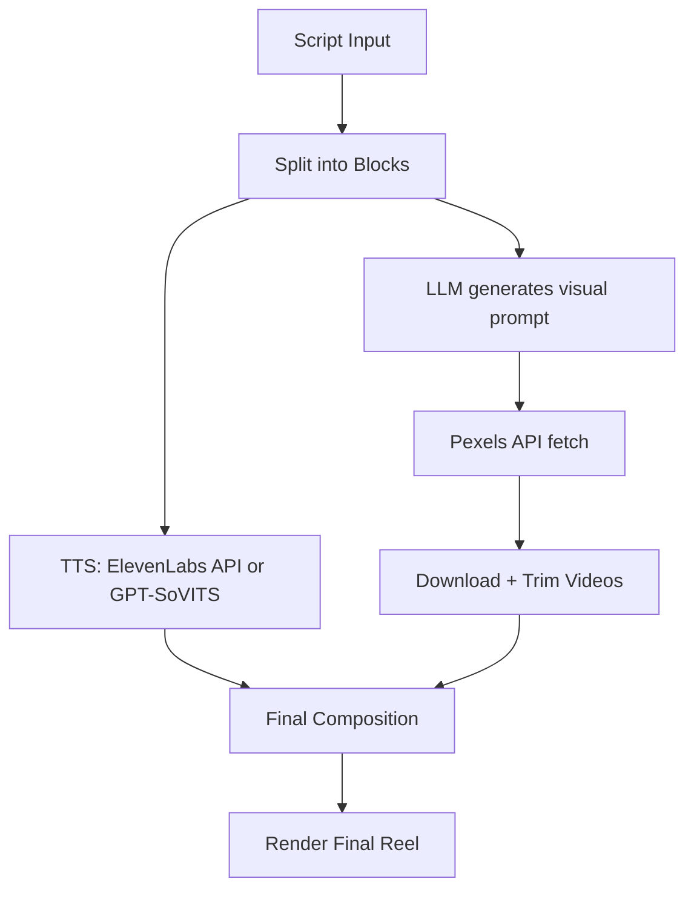

# Prompted Reels 🎥🤖

**Prompted Reels** is an AI-powered pipeline for creating faceless short-form videos (Reels, Shorts, TikToks) from scripts. It combines voice synthesis, visual matching, and LLM-powered scene generation to automate the video creation process.

---

## 🚀 Getting Started

### 1. Clone the Project

```bash
git clone https://github.com/yourusername/prompted-reels.git
cd prompted-reels
```

### 2. Install Dependencies

```bash
python -m venv venv
source venv/bin/activate  # On Windows use `venv\Scripts\activate`
pip install -r requirements.txt
```

### 3. Setup Environment Variables

Create a `.env` file and fill in:

```env
PEXELS_API_KEY=your_pexels_key
TEXT2VIDEO_API_KEY=your_open_sora_or_gen2_key
ELEVEN_LABS_API_KEY=your_eleven_labs_key
LLM_API_KEY=your_llm_key  # DeepSeek or Claude
```

### 4. Start the FastAPI Server

```bash
uvicorn api.main:app --reload
```

---

## 📐 Architecture Overview



---

## 🎤 Voice Generation (TTS)

### 1. ElevenLabs (Recommended)

* High-quality, real-time speech synthesis
* Custom voices or stock narrator

Request example:

```bash
POST https://api.elevenlabs.io/v1/text-to-speech/<voice_id>
Authorization: Bearer $ELEVEN_LABS_API_KEY
```

### 2. GPT-SoVITS

* Alternative open-source model for voice cloning
* Can be self-hosted and fine-tuned on character voices

---

## 🎞️ Visual Matching

### LLM-Powered Scene Matching

Each narration block is sent to the LLM to generate a video search prompt. Example prompt:

```
"Given a narration line, return a relevant search phrase for the Pexels API to find a matching video clip."
```

### Pexels API Integration

We fetch top-matching free stock video clips and trim them to fit the target duration. The best match is selected using embedding-based similarity.

---

## 🎨 Final Composition

### 1. Block-Level Output

Each narration block produces:

* `audio/block_0.mp3`
* `video/block_0.mp4`

### 2. Stitching

Using FFmpeg or `moviepy`, we merge blocks into:

* `full_video.mp4`
* `subtitles.srt` (optional)

---

## 📁 Project Folder Structure

```
my_project/
├── audio/
│   ├── block_0.mp3
│   └── block_1.mp3
├── video/
│   ├── block_0.mp4
│   └── block_1.mp4
├── processed.json
└── full_video.mp4
```

---

## 🧪 API Usage (FastAPI)

### List Projects

```bash
GET /projects
```

### Create Project

```bash
POST /create_project
```

### Generate Media

```bash
POST /generate_media
```

### Process Block

```bash
POST /process_block
```

### Compose Final Video

```bash
POST /compose?project_name=xyz
```

---