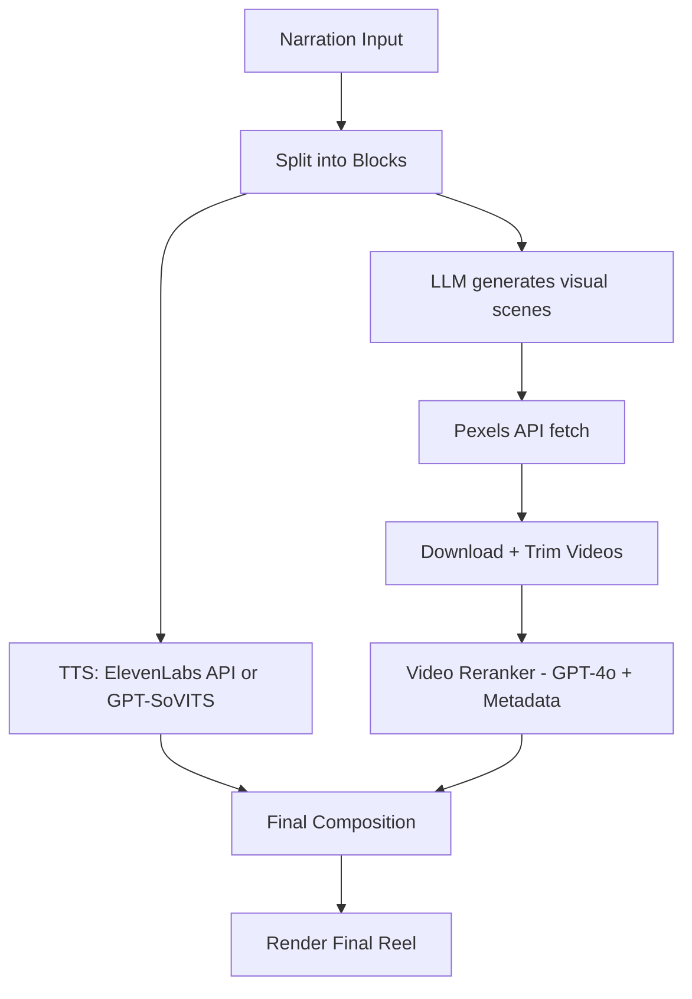

# Prompted Reels 🎥🤖

**Prompted Reels** is an AI-powered pipeline for turning plain ideas into structured, faceless short-form videos (Reels, Shorts, TikToks). It combines voice synthesis, visual matching, and LLM-powered scene generation to automate the video creation process.

---

## 🚀 Getting Started

### 1. Clone the Project

```bash
git clone https://github.com/chaparalatharun/PromptedReels.git
cd PromptedReels
```

---

## 🐍 Backend Setup (FastAPI)

### 2. Create Python Virtual Environment

```bash
python -m venv venv
source venv/bin/activate  # On Windows use `venv\Scripts\activate`
```

### 3. Install Python Dependencies

```bash
pip install -r requirements.txt
```

### 4. Setup Environment Variables

Create a `.env` file and fill in:

```env
PEXELS_API_KEY=your_pexels_key
ELEVEN_LABS_API_KEY=your_eleven_labs_key
OPENAI_API_KEY=your_openai_key  # For GPT-4o reranking
```

### 5. Start the FastAPI Server

```bash
uvicorn api.main:app --reload
```

---

## 🖥️ Frontend Setup (React)

### 1. Navigate to Frontend Directory

```bash
cd frontend  # or the directory where your frontend lives
```

### 2. Install Node.js Dependencies

```bash
npm install
```

### 3. Run the Development Server

```bash
npm run dev
```

This will start the frontend on `http://localhost:5173` (default for Vite or similar tooling).

This setup runs both backend and frontend together using a single command, so you don't need to start the FastAPI server separately.

---

## 📊 Architecture Overview



---

## 🎤 Voice Generation (TTS)

### 1. ElevenLabs (Recommended)

* High-quality, real-time speech synthesis
* Custom voices or stock narrator

### 2. GPT-SoVITS

* Alternative open-source model for voice cloning
* Can be self-hosted and fine-tuned on character voices

---

## 🎮 Visual Matching

### Scene Planning with GPT-4o

Each narration block is passed through an LLM to generate a sequence of specific visual scenes using the `plan_visual_scenes` function (see `api/services/scene_planner.py`).

The LLM receives:

* The full narration block
* Optional user prompt or visual guidance
* Total narration duration (e.g., 8 seconds)

Returns structured JSON like:

```json
[
  { "description": "man brushing teeth in mirror", "target_sec": 4 },
  { "description": "alarm clock ringing at 6 AM", "target_sec": 4 }
]
```

Each description is then used to search for relevant stock videos using the Pexels API.

### Pexels API Integration

We fetch top-matching stock video clips using scene descriptions. These are trimmed to fit the scene's target duration. To improve quality, we compute embedding similarity between the prompt and the video metadata (title, tags, etc.) to select top candidates.

A final reranker (GPT-4o) then selects the best-matching clip using both metadata and visual previews.

---

## 🌍 Video Reranking with GPT-4o

In `api/services/video_reranker.py`, we use GPT-4o to select the best-matching video from a set of candidates based on the narration block, scene description, user prompt, and Pexels metadata.

**Flow:**

1. Send narration block, scene description, and user prompt
2. Attach candidate video thumbnails as visual proxies
3. Provide metadata for each video (title, tags, duration, etc.)
4. GPT-4o selects the most contextually accurate video clip

---

## 🎨 Final Composition

### 1. Block-Level Output

Each narration block produces:

* `audio/block_0.mp3`
* `video/block_0.mp4`

### 2. Stitching

Using FFmpeg or `moviepy`, we merge blocks into:

* `full_video.mp4`
* `subtitles.srt` (optional)

---

## 📁 Project Folder Structure

```
my_project/
├── audio/
│   ├── block_0.mp3
│   └── block_1.mp3
├── video/
│   ├── block_0.mp4
│   └── block_1.mp4
├── processed.json
└── full_video.mp4
```

---

## 🌱 Future Roadmap

* [ ] Local model integration (LLMs, TTS, reranker)
* [ ] AI-generated video synthesis using models like Open-Sora
* [ ] Music/ambient background support
* [ ] Subtitle alignment and smoothing improvements
* [ ] Complex scene scripting (camera motion, transitions, pacing)
* [ ] Frontend UI improvements (storyboard view, timeline editor)
* [ ] Optional B-roll layering
* [ ] Platform publishing (YouTube, TikTok)

---

## 🙌 Credits

This project is a complete rework by **Tharun Chaparala**. Although originally forked, none of the original code remains — even `api/api.py` and `start_server.py` were rewritten from scratch.
