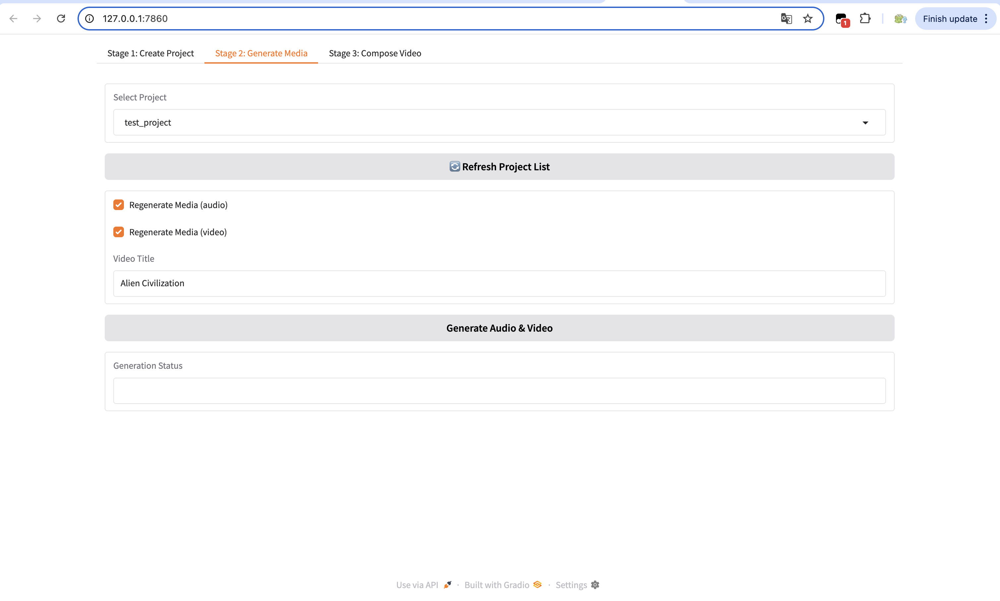

# VideoAutoMaker 🎥🤖

VideoAutoMaker is an automated AI-powered video generation pipeline that takes a script and turns it into fully-formed video segments with matching visuals, TTS audio, and metadata — ready for platforms like YouTube, TikTok, and Bilibili.

- Text-To-Video Model: **Wan-AI/Wan2.1-T2V-14B-Turbo**
- Audio Model: **GPT-SoVITS(Fine-Tuning)**
- LLM Model: **DeepSeekV3**

## 🖼️ Web UI Preview

 <!-- replace with actual image path -->

📺 **Example video (Chinese):**

[](https://www.youtube.com/watch?v=RjH_D1CPzps)


---

## ✨ Features

- 🔊 **Text-to-Speech**: Converts script into speech using GPT-SoVITS or fine-tuned character voices
- 🎬 **Visual Matching**: LLM-generated search terms fetch relevant video clips from Pexels
- 📥 **HD Video Download**: Auto fetches the best matching stock videos
- 🧠 **Scene Matching with LLM**: Script lines become high-quality video prompts
- 🎞️ **Text-to-Video Generation**: Uses models like Open-Sora for AI-generated visuals
- ✅ **JSON + Media Pipeline**: Supports block-level audio/video regeneration
- ⚙️ **FastAPI-based Control**: Full programmatic control via RESTful endpoints

---

## 📦 Folder Structure

Your project output will look like:

```text
my_project/
├── audio/
│   ├── myproj_1.mp3
│   └── myproj_2.mp3
├── video/
│   ├── myproj_1.mp4
│   └── myproj_2.mp4
├── processed.json
└── subtitles.srt
```

---

## 🧠 LLM Prompt Format

```text
"Given a text script clip, I want to search the corresponding video clip that can match the script, for presentation. Give me the video searching sentence in Pexels API."
```

---

## 🔐 API Configuration

Update your environment or config with keys:

```python
PEXELS_API_KEY = "your_pexels_key"
LLM_API_HEADERS = {
  "Authorization": "Bearer your_llm_token",
  "Content-Type": "application/json"
}
TEXT2VIDEO_API_KEY = "your_text2video_key"
```

---

## 🧪 API Endpoints (FastAPI)

Start server:

```bash
python start_server.py
```

### ✅ 1. List Projects

```bash
curl http://localhost:8000/projects
```

### ✅ 2. Create a Project

```bash
curl -X POST http://localhost:8000/create_project \
  -H "Content-Type: application/json" \
  -d '{
    "project_name": "demo_project",
    "theme": "宇宙起源",
    "script": "宇宙诞生于一次大爆炸。\\n生命起源于海洋。"
}'
```

### ✅ 3. Generate Media

```bash
curl -X POST http://localhost:8000/generate_media \
  -H "Content-Type: application/json" \
  -d '{
    "project_name": "demo_project",
    "reGen_audio": true,
    "reGen_video": true,
    "theme": "AI Documentary"
}'
```

### ✅ 4. Process a Single Block

```bash
curl -X POST http://localhost:8000/process_block \
  -H "Content-Type: application/json" \
  -d '{
    "project_name": "demo_project",
    "block_index": 0,
    "reGen_audio": true,
    "reGen_video": false
}'
```

### ✅ 5. Get Project JSON

```bash
curl http://localhost:8000/project_json/demo_project
```

### ✅ 6. Update Project JSON

```bash
curl -X POST http://localhost:8000/update_project_json \
  -H "Content-Type: application/json" \
  -d '{
    "project_name": "demo_project",
    "data": {
      "theme": "Updated Theme",
      "script": [{"text": "New narration line", "character": "Narrator"}]
    }
}'
```

### ✅ 7. Compose Final Video

```bash
curl -X POST "http://localhost:8000/compose?project_name=demo_project"
```

---

## 🧩 Requirements

- Python 3.9+
- Docker (optional)
- API Keys:
  - TTS endpoint (e.g., GPT-SoVITS)
  - Pexels video API
  - LLM (e.g., DeepSeek, Claude)
  - (Optional) Text-to-video service like Open-Sora, Gen-2

---

## 🚧 Future Improvements

- Subtitle timestamp smoothing (via Whisper)
- FFmpeg-based auto merge (video + audio + srt)
- Music / ambient tracks
- Full pipeline: YouTube/Bilibili upload

---

## 💡 Credits

Built with ❤️ by NP_123
Powered by GPT, Pexels, and open tools like SoVITS and FastAPI.
